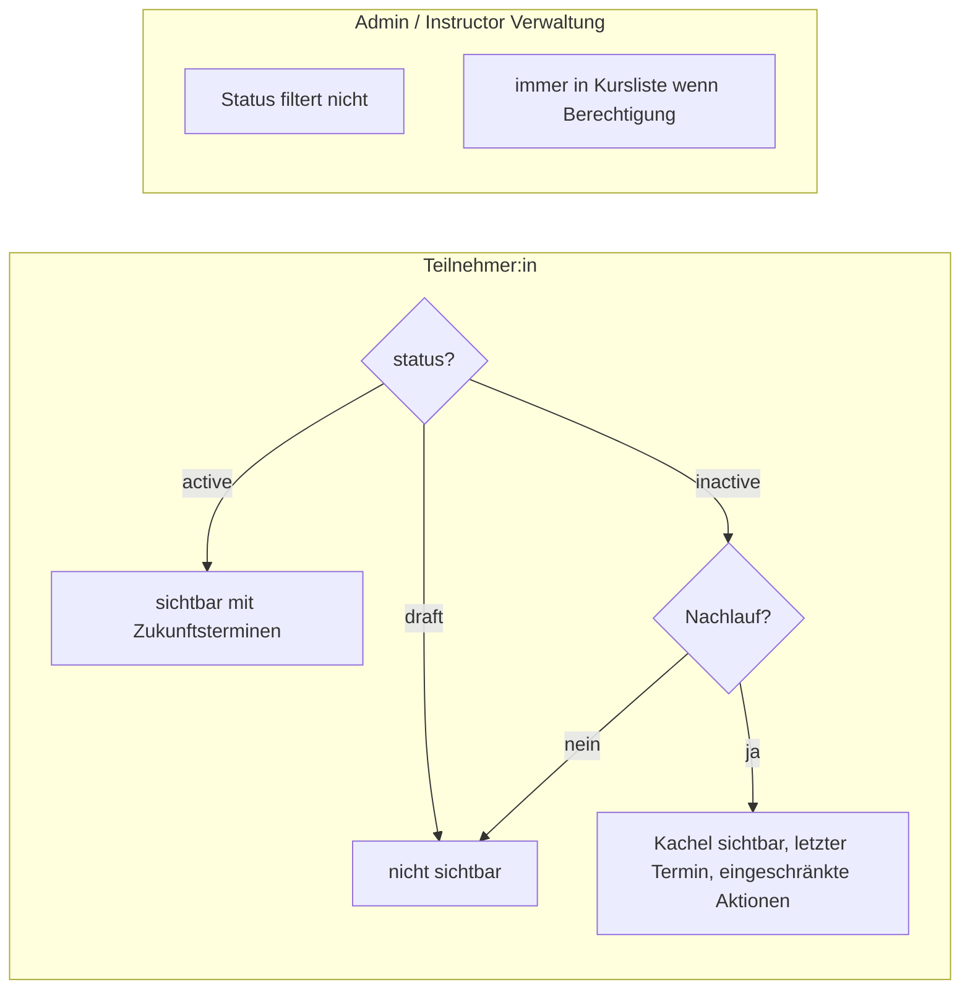
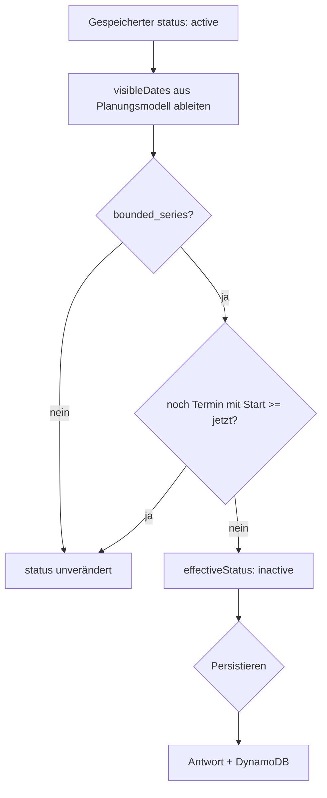
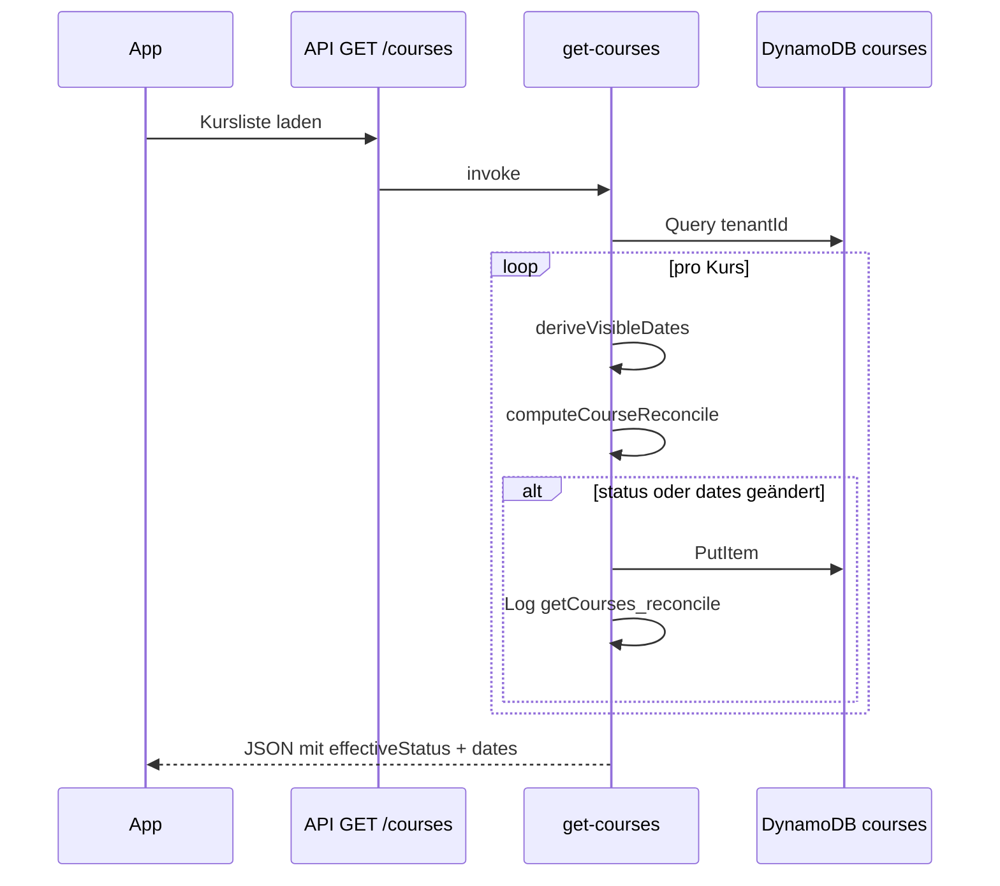

# Kursstatus, Sichtbarkeit und Auto-Transition (#149)

Dokumentation zum Verhalten ab Issue [#149](https://github.com/CurlyKarin/yogaswap/issues/149): welche Kurse Teilnehmer:innen sehen, wann ein Kursblock automatisch `inactive` wird, und wie der Nachlauf mit dem Tauschfenster zusammenhängt.

## Kurzfassung

| Thema | Verhalten |
|--------|-----------|
| **`draft`** | Teilnehmer:innen sehen den Kurs nicht. |
| **`active`** | Normale Sichtbarkeit; Termine über `getCourseDates` (Datum + Uhrzeit ≥ jetzt). |
| **`active` → `inactive`** | Automatisch bei **Kursblock** (`bounded_series`), wenn kein Termin mehr in der Zukunft liegt (Datum **und** Uhrzeit). |
| **Nachlauf** | Nach Kursende bleibt ein **`inactive`** Kurs für Teilnehmer:innen noch **X Kalendertage** sichtbar (Default **7**, UTC). |
| **Lazy Reconcile** | Beim **`GET /courses`** (`get-courses` Lambda) werden Status und abgeleitete `dates` bei Bedarf in DynamoDB nachgezogen. |

Studio-Konfiguration für den Nachlauf perspektivisch über Tenant-Settings ([#44](https://github.com/CurlyKarin/yogaswap/issues/44)), siehe Abschnitt [Nachlauf und Tauschfenster](#nachlauf-und-tauschfenster).

---

## Sichtbarkeit nach Rolle



**Quelle im Code:** `shared/src/permissions.ts` — `canSeeCourse`, `canShowParticipantCourseCard`.

Teilnehmer-Kachel auch **ohne Zukunftstermine**, wenn:

- `inactive` im Nachlauf, oder
- `active`, Termin vorbei, aber noch innerhalb des Nachlaufs (`isWithinPostCourseEndGrace` — Übergangsphase bis Reconcile).

---

## Automatischer Übergang `active` → `inactive`

Gilt nur für **`bounded_series`** (Kursblock), nicht für durchlaufende Kurse (`rolling_continuous`, siehe [#165](https://github.com/CurlyKarin/yogaswap/issues/165)).

**Bedingung:** Kein Eintrag in den abgeleiteten sichtbaren Terminen (`visibleDates`), dessen **Kursbeginn** (ISO-Datum + `time`) noch ≥ jetzt ist.



**Auslöser (gleiche Regel):**

| Pfad | Lambda / Handler |
|------|------------------|
| Kursliste laden | `get-courses` → `GET /courses` |
| Kurs speichern | `update-course` → `PUT /courses/{id}` |
| Kurs anlegen | `create-course` → `POST /courses` |

**Wichtig:** Die alte Prüfung nur auf Kalendertag (`datum >= heute`) würde am **Termintag** noch `active` lassen. Aktuell gilt überall **Datum + Uhrzeit** (`hasUpcomingCourseOccurrences` in `shared/src/courseStatus.ts` bzw. `backend/src/lambdas/shared/courseDates.ts`).

Manuelles `active` → `inactive` bleibt an bestehende Guards gebunden (offene Termine, Swaps, Teilnehmer) — nur in `updateCourse`, nicht beim Lazy Reconcile.

---

## Lazy Reconcile in `getCourses`



**Lambda:** `get-courses` (ZIP: `getCourses.zip`, Code: `backend/src/lambdas/getCourses/index.ts`).

**IAM:** `dynamodb:PutItem` auf der Courses-Tabelle (Terraform: `get_courses` in `projects/yogaswap/main.tf`).

**Logs (CloudWatch):** u. a. `reason: empty_future_schedule`, `source: getCourses_reconcile`.

Deploy ändert **keine** bestehenden Kurse von selbst — der Effekt entsteht beim **nächsten** erfolgreichen `GET /courses` nach Ausrollen der Lambda.

---

## Nachlauf und Tauschfenster

Nach dem **letzten Kursende** (`courseEndDateIso`: `seriesEndDate` → `visibleUntil` → max aus `dates`) bleiben inaktive Kursblöcke für Teilnehmer:innen noch sichtbar:

```
letzterTagNachlauf = Kursende + inactiveGraceDaysAfterCourseEnd   (Kalendertage, UTC)
```

| Einstellung | Ort (aktuell) | Default |
|-------------|---------------|---------|
| Nachlauf nach Kursende | `TenantSettings.inactiveGraceDaysAfterCourseEnd` | **7** |
| Tauschfenster (App-Demo) | `app/src/data/swapSettings.ts` (`minOffsetDays` / `maxOffsetDays`) | **-7 / +7** |

**Produktentscheidung (#149):** Nachlauf und Swap-Fenster sollen **dieselbe Konfigurationsfamilie** nutzen (nicht zwei willkürlich getrennte Konstanten). Bis die Studio-UI ([#44](https://github.com/CurlyKarin/yogaswap/issues/44)) das abbildet, ist der Nachlauf-Default an `maxOffsetDays` angeglichen.

Im Nachlauf:

- Kurskachel mit Badge „Automatisch inaktiv“ / „Inaktiv“
- **Letzter Termin** im Dropdown (auch ohne Zukunftstermine in `getCourseDates`)
- Keine neuen Absagen/Tauschanfragen; offene Swaps noch verwalten (Hinweistext mit Enddatum des Nachlaufs)

**Quelle:** `shared/src/courseStatus.ts`, `app/src/components/CourseCard.tsx`, `app/src/components/CourseList.tsx`.

---

## Admin-Hinweise in der UI

| Anzeige | Bedeutung |
|---------|-----------|
| **wird beim Speichern inaktiv** | DB noch `active`, aber keine Zukunftstermine (heuristisch `wouldAutoDeactivateBoundedSeries`) |
| **automatisch inaktiv** | `inactive` und typisch per Auto-Transition gesetzt |

Nach erfolgreichem Reconcile verschwindet „wird beim Speichern inaktiv“ zugunsten von **Inaktiv** / **automatisch inaktiv**.

---

## Relevante Dateien

| Bereich | Datei |
|---------|--------|
| Permissions | `shared/src/permissions.ts` |
| Kursende / Nachlauf / Occurrences | `shared/src/courseStatus.ts` |
| Tenant-Typ | `shared/src/types.ts` (`inactiveGraceDaysAfterCourseEnd`) |
| Reconcile-Logik | `backend/src/lambdas/shared/courseReconcile.ts` |
| GET Kurse | `backend/src/lambdas/getCourses/index.ts` |
| Terminliste UI | `app/src/lib/dates.ts` (`getCourseDates`) |
| Kurskarte | `app/src/components/CourseCard.tsx` |

---

## Mermaid in Cursor anzeigen

Diese Datei in Cursor öffnen → **Markdown-Vorschau** (`Cmd+Shift+V` / `Ctrl+Shift+V`). Mermaid-Blöcke werden in der Vorschau gerendert.

Extern: [mermaid.live](https://mermaid.live) oder GitHub nach Push.

---

## Siehe auch

- [#149](https://github.com/CurlyKarin/yogaswap/issues/149) — Umsetzung Sichtbarkeit + Auto-Transition
- [#44](https://github.com/CurlyKarin/yogaswap/issues/44) — Studio-Settings (Tauschfenster + geplanter Nachlauf)
- [#129](https://github.com/CurlyKarin/yogaswap/issues/129) — Lifecycle-Guardrails (`updateCourse` / Prune)
- [#165](https://github.com/CurlyKarin/yogaswap/issues/165) — Rollende Kurse mit optionalem Ende
