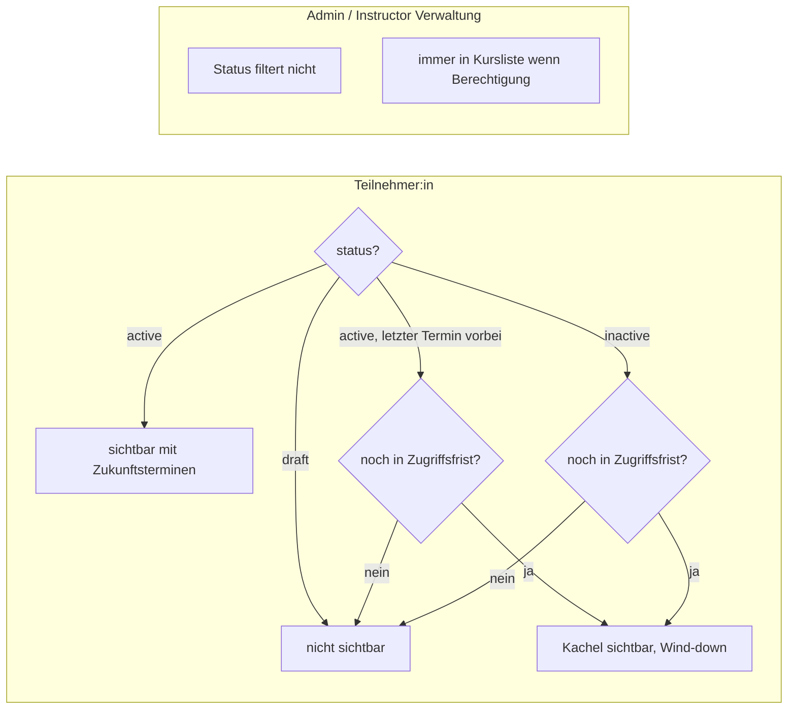
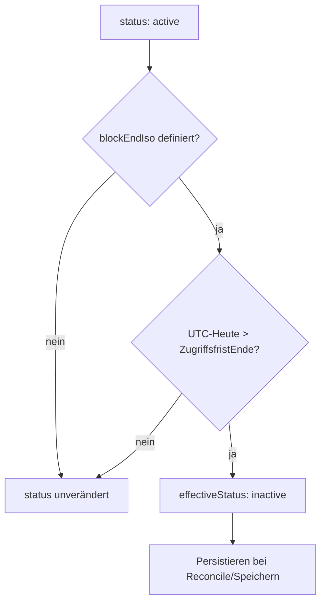
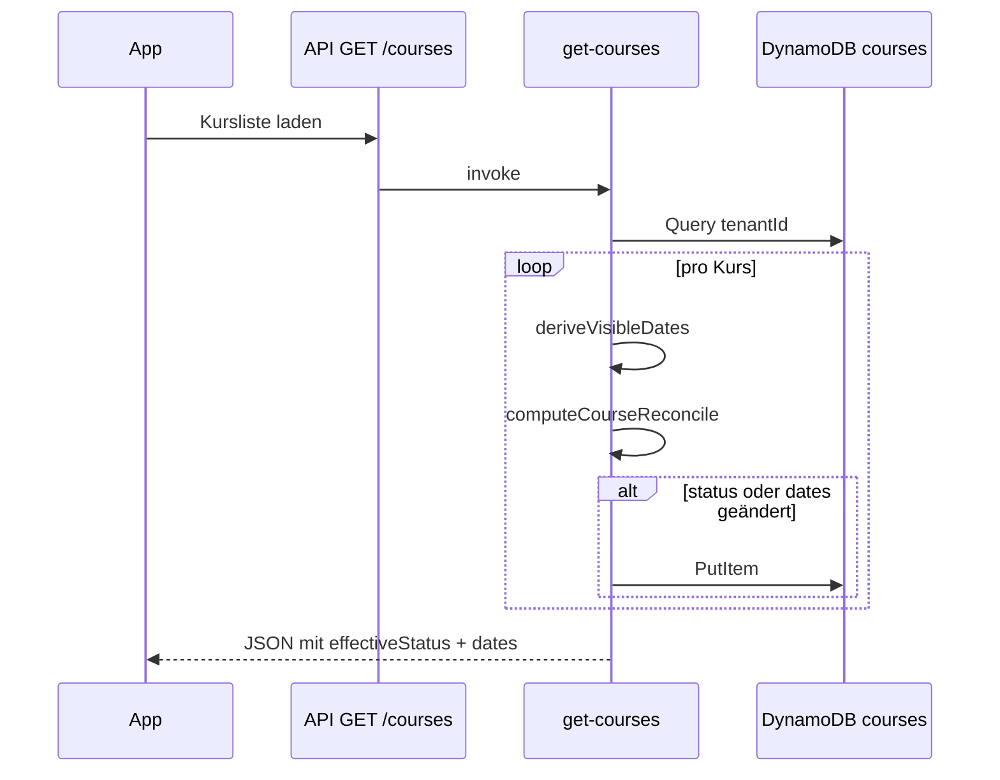

# Kursstatus, Sichtbarkeit und Auto-Transition (#149, #204)

Dokumentation zum Verhalten ab Issue [#149](https://github.com/CurlyKarin/yogaswap/issues/149) und [#204](https://github.com/CurlyKarin/yogaswap/issues/204): welche Kurse Teilnehmer:innen sehen, wann ein Kursblock automatisch `inactive` wird, und wie der Nachlauf mit dem Tauschfenster zusammenhängt.

## Kurzfassung

| Thema | Verhalten |
|--------|-----------|
| **`draft`** | Teilnehmer:innen sehen den Kurs nicht. |
| **`active`** | Normale Sichtbarkeit; Termine über `getCourseDates` (Datum + Uhrzeit ≥ jetzt). |
| **`active` → `inactive`** | Automatisch, wenn ein **Blockende** definiert ist und der UTC-Kalendertag **nach** der Zugriffsfrist liegt (siehe unten). Nicht mehr allein bei „kein Zukunftstermin“. |
| **Nachlauf** | Teilnehmer:innen sehen den Kurs nach dem letzten Termin noch bis zum **gleichen Fristtag** wie die Auto-Inaktiv-Schwelle (Default-Nachlauf **7** Kalendertage nach letztem Termin, UTC). |
| **Lazy Reconcile** | Beim **`GET /courses`** werden Status und abgeleitete `dates` bei Bedarf in DynamoDB nachgezogen. |

Studio-Konfiguration: **Admin → Studio-Einstellungen** ([#44](https://github.com/CurlyKarin/yogaswap/issues/44)) — `inactiveGraceDaysAfterCourseEnd`, `minOffsetDays`, `maxOffsetDays`, `rollingPlanningHorizonWeeks`. Rollkurse: [rolling-courses-planning.md](./rolling-courses-planning.md).

---

## Sichtbarkeit nach Rolle



**Quelle:** `shared/src/permissions.ts` — `canSeeCourse`, `canShowParticipantCourseCard`.

Teilnehmer-Kachel auch **ohne Zukunftstermine**, wenn:

- `inactive` und noch innerhalb der Zugriffsfrist, oder
- `active`, letzter Termin vorbei, aber noch in der Zugriffsfrist (`isWithinPostCourseEndGrace` — bis Reconcile oder bei laufendem Block).

---

## Zugriffsfrist und Auto-Inaktiv (#204)

Gemeinsame Schwelle für **Auto-Inaktiv** und **Teilnehmer-Sichtbarkeit/Wind-down**:

```
ZugriffsfristEnde = max( blockEndIso, letzterTerminIso + inactiveGraceDaysAfterCourseEnd )
```

| Symbol | Bedeutung |
|--------|-----------|
| `blockEndIso` | `courseBlockEndIso()` — `seriesEndDate` / `visibleUntil` (Kursblock) oder `plannedEndDate` (Rollkurs mit Ende) |
| `letzterTerminIso` | `lastScheduledOccurrenceIso()` — nur aus `dates`, kein seriesEndDate-Fallback |
| `inactiveGraceDaysAfterCourseEnd` | Studio-Einstellung (Default **7**, UTC-Kalendertage) |

**Im Code:** `effectiveAutoInactiveDeadlineIso` und `participantCourseAccessDeadlineIso` in `shared/src/courseStatus.ts` (identische Frist; Fallback ohne Blockende über `courseEndDateIso` + Nachlauf).

### Nach Planungsmodus

| Modus | Blockende | Auto-inaktiv |
|-------|-----------|--------------|
| `bounded_series` | `seriesEndDate` (ggf. `visibleUntil`) | Ja, nach obiger Formel |
| `rolling_continuous` **mit** `plannedEndDate` | `plannedEndDate` | Gleiche Regel |
| `rolling_continuous` **ohne** `plannedEndDate` | — | **Kein** Auto-inaktiv |

**Bedeutung:**

- Block läuft noch → Kurs bleibt `active`, auch ohne zukünftige Termine (Admin kann nachplanen).
- Letzter Termin **nach** dem Blockende → Frist und Sichtbarkeit enden erst nach **Termin + Nachlauf**.
- Liegt kein Termin in `dates`, gilt nur `blockEndIso` als Frist (ohne zusätzliche +7 Tage nur auf das Blockende).

---

## Automatischer Übergang `active` → `inactive`



**Auslöser (gleiche Regel):**

| Pfad | Lambda / Handler |
|------|------------------|
| Kursliste laden | `get-courses` → `GET /courses` |
| Kurs speichern | `update-course` → `PUT /courses/{id}` |
| Kurs anlegen | `create-course` → `POST /courses` |

Implementierung: `shouldAutoDeactivateCourse` in `shared/src/courseStatus.ts`, aufgerufen aus `backend/src/lambdas/shared/courseReconcile.ts`.

Manuelles `active` → `inactive` bleibt an bestehende Guards gebunden — nur in `updateCourse`, nicht beim Lazy Reconcile.

---

## Lazy Reconcile in `getCourses`



Deploy ändert bestehende Kurse erst beim **nächsten** erfolgreichen `GET /courses` nach Ausrollen.

---

## Nachlauf, Wind-down und Tauschfenster

### Kurs-Wind-down (`isParticipantCourseWindDown`)

Teilnehmer-Kachel im **Wind-down** (CSS `course-card--inactive-participant`, `participantActionsLocked`):

- Keine vollen Terminaktionen am **aktuellen/künftigen** Termin (keine Absage, kein neuer Tausch).
- **RC-Nachlauf** am **vergangenen** Termin bleibt möglich: „Anderen Termin wählen“, offene Anfragen verwalten, weitere Tauschanfragen (#204 Option A).

### Termin-Nachlauf (pro Vergangenheitstermin)

Unabhängig vom Kurs-Wind-down: **7 Tage** (Studio-Einstellung) nach einem vergangenen Termin für RC-Tausch (`isTermInParticipantSwapGrace`). Details: [course-views.md](./course-views.md).

| Einstellung | Default |
|-------------|---------|
| `inactiveGraceDaysAfterCourseEnd` | **7** |
| `minOffsetDays` / `maxOffsetDays` (Tauschfenster) | **-7 / +7** |
| `rollingPlanningHorizonWeeks` | **5** |

**Quellen:** `shared/src/courseStatus.ts`, `app/src/lib/courseTermActions.ts`, `app/src/lib/courseCardLabels.ts`, `app/src/components/CourseCard.tsx`.

---

## Admin-Hinweise in der UI

| Anzeige | Bedeutung |
|---------|-----------|
| **wird beim Speichern inaktiv** | DB noch `active`, aber UTC-Heute liegt nach `participantCourseAccessDeadlineIso` (`wouldAutoDeactivateBoundedSeries`) |
| **automatisch inaktiv** | `inactive` und typisch per Auto-Transition gesetzt |

---

## Relevante Dateien

| Bereich | Datei |
|---------|--------|
| Permissions | `shared/src/permissions.ts` |
| Frist / Nachlauf / Occurrences | `shared/src/courseStatus.ts` |
| Reconcile | `backend/src/lambdas/shared/courseReconcile.ts` |
| Wind-down / RC-Nachlauf UI | `app/src/lib/courseTermActions.ts`, `app/src/components/useCourseCardTermState.ts` |
| Hinweistexte | `app/src/lib/courseCardLabels.ts` |
| Kurskarte | `app/src/components/CourseCard.tsx`, `CourseTermActions.tsx` |

---

## Siehe auch

- [#149](https://github.com/CurlyKarin/yogaswap/issues/149) — Umsetzung Sichtbarkeit + Auto-Transition
- [#44](https://github.com/CurlyKarin/yogaswap/issues/44) — Studio-Settings (Nachlauf, Tauschfenster, Planungssperre)
- [#129](https://github.com/CurlyKarin/yogaswap/issues/129) — Lifecycle-Guardrails (`updateCourse` / Prune)
- [#165](https://github.com/CurlyKarin/yogaswap/issues/165) — Rollende Kurse mit optionalem Ende
- [#204](https://github.com/CurlyKarin/yogaswap/issues/204) — Auto-Inaktiv vs. Teilnehmer-Nachlauf
